<div align="center">
  
  <h1>DComicReborn</h1>
  <p><strong>多源漫画阅读 · 本地优先 · 自托管同步</strong></p>
  <p>在手机、平板与桌面之间，接着读。</p>
  <p>
    <a href="https://github.com/hanerx/DComicReborn/releases/latest"></a>
    <a href="https://github.com/hanerx/DComicReborn/releases"></a>
    <a href="https://github.com/hanerx/DComicReborn/releases"></a>
  </p>
  <p>
    <a href="#下载">下载</a> &nbsp; / &nbsp;
    <a href="#介绍">介绍</a> &nbsp; / &nbsp;
    <a href="#界面预览">界面预览</a> &nbsp; / &nbsp;
    <a href="#部署同步服务器">部署同步服务器</a> &nbsp; / &nbsp;
    <a href="#如何开发">开发指南</a> &nbsp; / &nbsp;
    <a href="#鸣谢">鸣谢</a>
  </p>
</div>

## 下载

<p align="center">
  <a href="https://github.com/hanerx/DComicReborn/releases/latest/download/app-release.apk"></a>
  <a href="https://github.com/hanerx/DComicReborn/releases/latest/download/ios-release.ipa"></a>
  <a href="https://github.com/hanerx/DComicReborn/releases/latest"></a>
  <a href="https://github.com/hanerx/DComicReborn/releases/latest"></a>
  <a href="https://hub.docker.com/r/hanerx/dcomic_server"></a>
</p>

<p align="center">
  <a href="https://github.com/hanerx/DComicReborn/releases">历史版本</a> ·
  <a href="RELEASE_NOTES.md">更新说明</a> ·
  <a href="https://github.com/hanerx/DComicReborn/actions/workflows/main.yml">开发构建</a>
</p>

| 平台 | 系统要求 | 安装方式 |
| :--- | :--- | :--- |
| **Android** | Android 7.0+ | 下载 APK，允许安装此来源的应用。 |
| **iOS** | iOS 15+ | IPA **未签名**，需要自行签名安装，不是 App Store 安装包。 |
| **Windows** | Windows 10+ · x64 | 安装版 EXE / 免安装 ZIP，详见下方说明。 |
| **macOS** | macOS 12.0+ · Apple Silicon / Intel | 通用架构 DMG / ZIP，详见下方说明。 |

<details>
<summary><strong>Windows 下载与安装须知</strong></summary>

Windows 正式发布提供 portable ZIP 和安装版 EXE，请以[发布页实际附件](https://github.com/hanerx/DComicReborn/releases/latest)为准。开发构建可在成功的 Actions 运行中查找 `windows-release`（需登录 GitHub），也可按下文自行构建。

选择 `windows-x64-setup.exe` 安装版，或 `windows-x64-portable.zip` 免安装版；文件名前带应用名和版本号。

免安装版须完整解压，保留 EXE 同目录的 DLL 和 `data`。Windows 包尚未配置代码签名，可能出现未知发布者或 SmartScreen 提示。

</details>

<details>
<summary><strong>macOS 下载与安装须知</strong></summary>

从[发布页](https://github.com/hanerx/DComicReborn/releases/latest)下载文件名含 `macos-universal` 的 DMG 或 ZIP。DMG 打开后将 `DComicReborn.app` 拖入 Applications；ZIP 解压后将完整 `.app` 移入“应用程序”，不要拆出其中的可执行文件。

包使用 ad-hoc 签名，尚未进行 Developer ID 签名或 Apple 公证。首次启动可能被 Gatekeeper 拦截；确认下载来源可信后，在“系统设置 → 隐私与安全性”中选择“仍要打开”。不要为此全局关闭 Gatekeeper。

开发构建在 Actions 中下载 `macos-release` artifact；实际可用附件以成功的构建为准。

</details>

## 介绍

**DComicReborn 是使用 Flutter 开发的第三方多源漫画阅读应用**，面向 Android、iOS、Windows 和 macOS。浏览、收藏、阅读和记录在同一套界面中完成；需要多设备接力时，再连接自己的同步服务器。

| 找到想看的 | 按习惯阅读 | 保留自己的记录 |
| :--- | :--- | :--- |
| 拷贝 / 热辣 / 再漫画，多源搜索与分类排行 | 左右翻页、纵向阅读、章节目录与章末吐槽 | 本地保存阅读记录与设置，可选文件备份 |
| 收藏更新提示，同一本漫画跨源绑定 | 深浅主题与阅读配色，手机单栏 / 宽屏双栏 | 自托管多设备同步，按分类选择同步内容 |

> 不部署同步服务器也能使用应用。同步服务只管理用户和同步数据，**不提供或代理漫画内容**；源站账户与同步账户互相独立。

本项目不是漫画站点的官方客户端，内容与接口可用性取决于源站及网络。漫画及相关图片版权归原权利人所有；跨源进度聚合等实验性功能需单独开启。

## 界面预览

<p align="center"><strong>从选书到阅读，再到按自己的习惯设置。</strong><br><sub>功能截图统一使用浅色模式；主题色与日夜模式在独立的合成图中对照展示。截图来自实际应用，账户信息已遮盖；点击图片查看大图。</sub></p>

### 浏览与选书

<table>
  <tr>
    <td align="center" width="33%"><strong>收藏与更新</strong><br><sub>封面书架 · 更新角标 · 跨源绑定</sub></td>
    <td align="center" width="33%"><strong>漫画详情</strong><br><sub>封面与简介 · 开始阅读</sub></td>
    <td align="center" width="33%"><strong>侧栏导航</strong><br><sub>切换内容源 · 收藏 · 历史</sub></td>
  </tr>
  <tr>
    <td align="center"><a href="docs/screenshots/favorites.webp">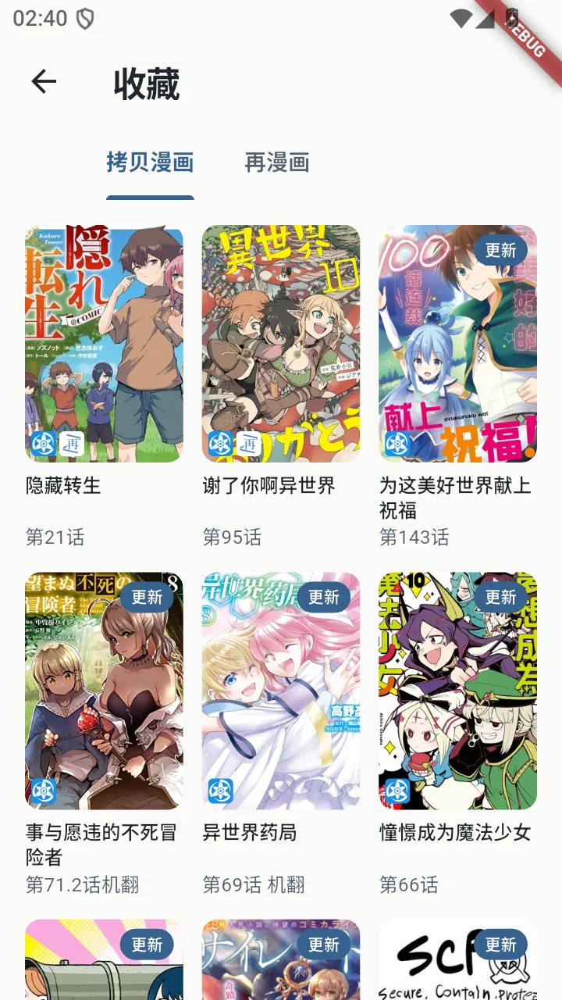</a></td>
    <td align="center"><a href="docs/screenshots/detail.webp">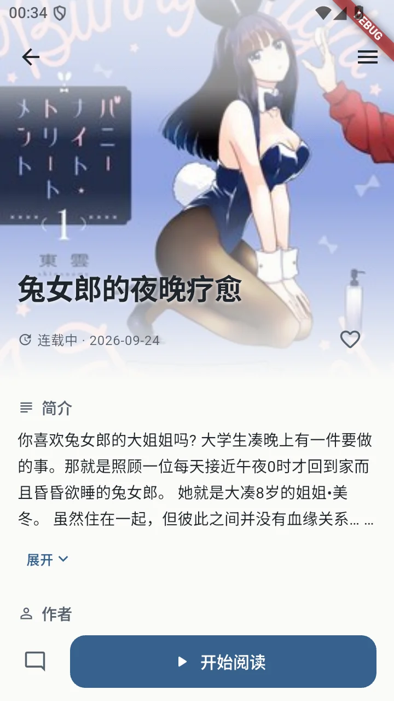</a></td>
    <td align="center"><a href="docs/screenshots/navigation.webp">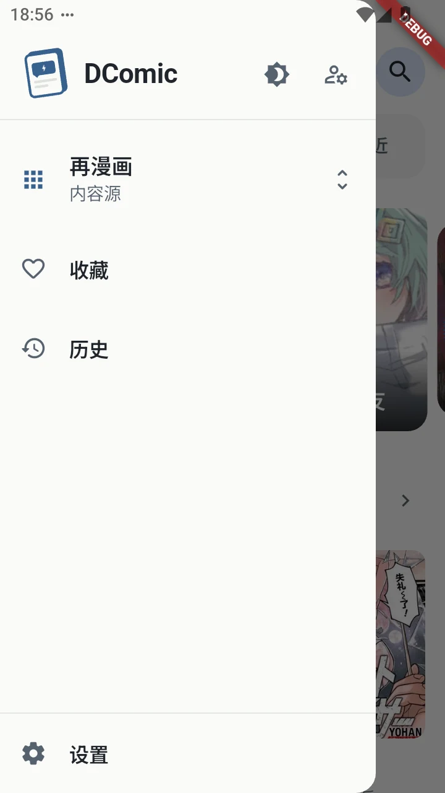</a></td>
  </tr>
</table>

### 搜索

<table>
  <tr>
    <td align="center" width="50%"><strong>搜索历史</strong><br><sub>保留最近关键词 · 点击再次搜索</sub></td>
    <td align="center" width="50%"><strong>多源搜索</strong><br><sub>同一关键词 · 按漫画源切换结果</sub></td>
  </tr>
  <tr>
    <td align="center"><a href="docs/screenshots/search.webp">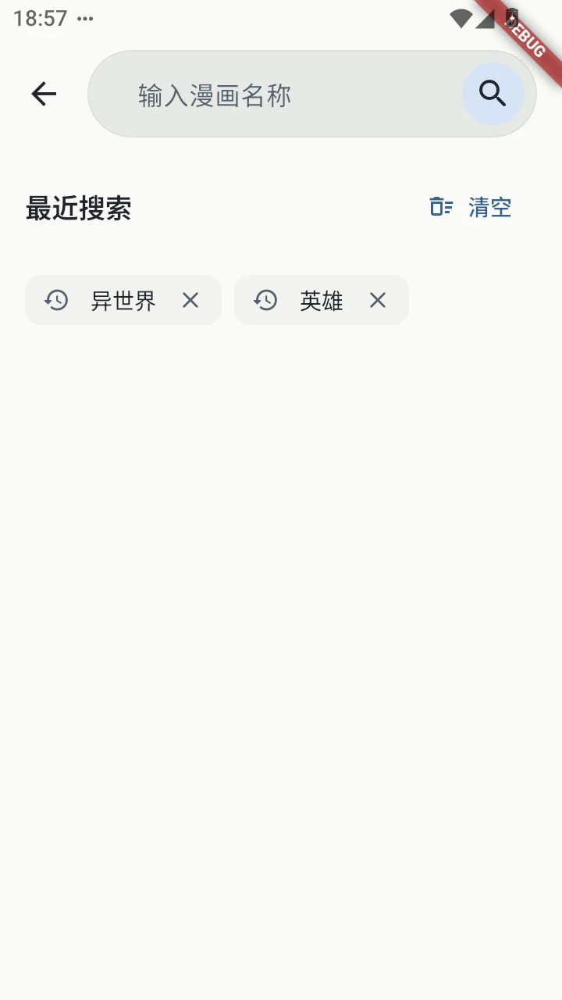</a></td>
    <td align="center"><a href="docs/screenshots/search-results.webp">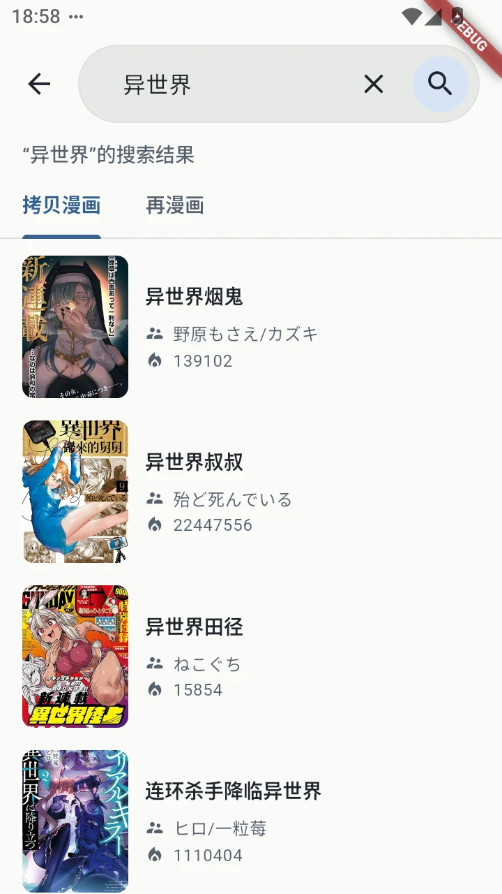</a></td>
  </tr>
</table>

### 阅读与外观

<table>
  <tr>
    <td align="center" width="50%"><strong>阅读器</strong><br><sub>翻页 · 进度 · 章节工具栏</sub></td>
    <td align="center" width="50%"><strong>阅读外观</strong><br><sub>面板配色 · 主题 · 触控区域</sub></td>
  </tr>
  <tr>
    <td align="center"><a href="docs/screenshots/reader.webp">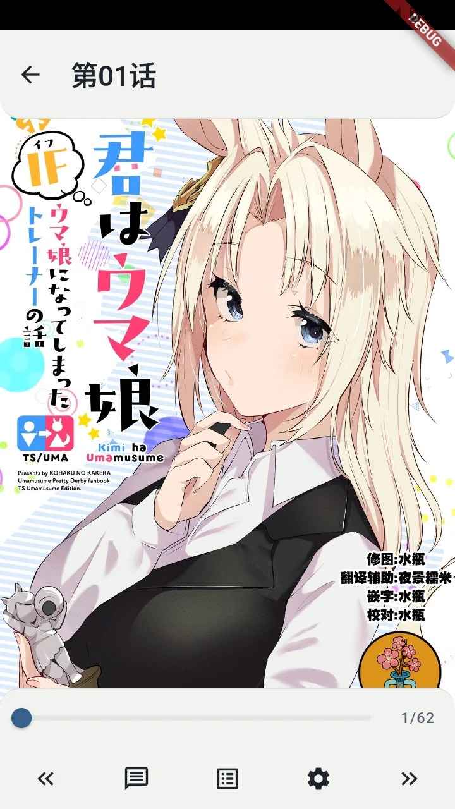</a></td>
    <td align="center"><a href="docs/screenshots/reader-appearance.webp">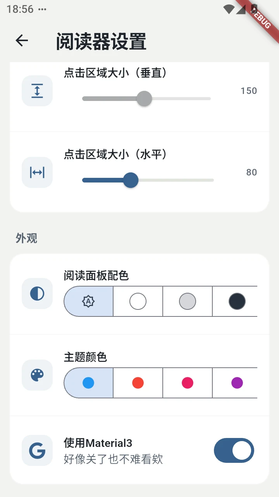</a></td>
  </tr>
</table>

阅读设置中的横向、竖向点击区域按阅读器当前可视宽度／高度的百分比计算，两侧对称、分别保存：默认每侧 20%，可调 5%～40%，两侧合计最多 80%，中间始终至少保留 20% 用于显示／隐藏菜单。窗口缩放、分屏与旋转后自动适配，图片页和章末吐槽页使用同一比例；可开启“显示点击区域”查看范围。

### 应用设置

<table>
  <tr>
    <td align="center" width="33%"><strong>应用设置</strong></td>
    <td align="center" width="33%"><strong>漫画源设置</strong></td>
    <td align="center" width="33%"><strong>关于与更新</strong></td>
  </tr>
  <tr>
    <td align="center"><a href="docs/screenshots/settings.webp">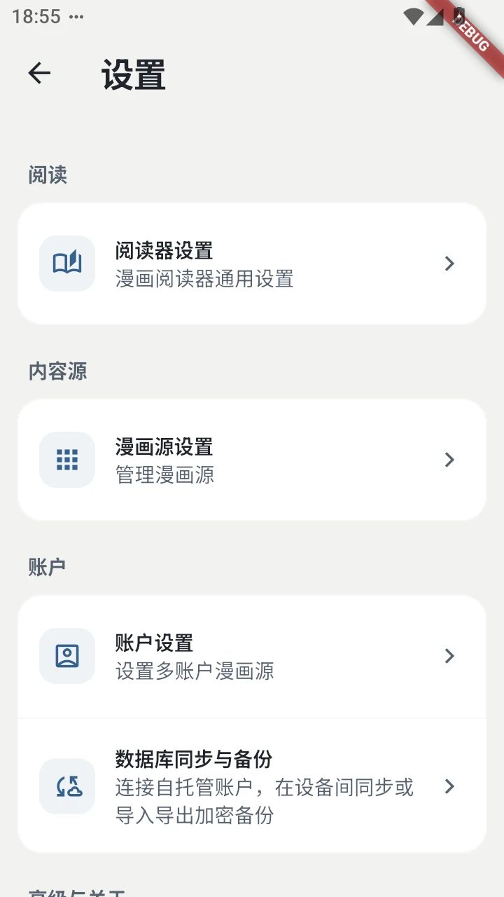</a></td>
    <td align="center"><a href="docs/screenshots/sources.webp">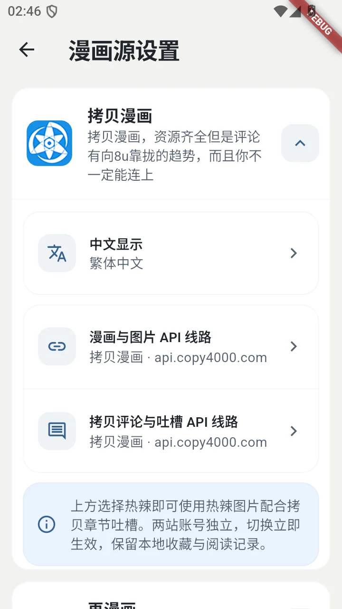</a></td>
    <td align="center"><a href="docs/screenshots/about.webp">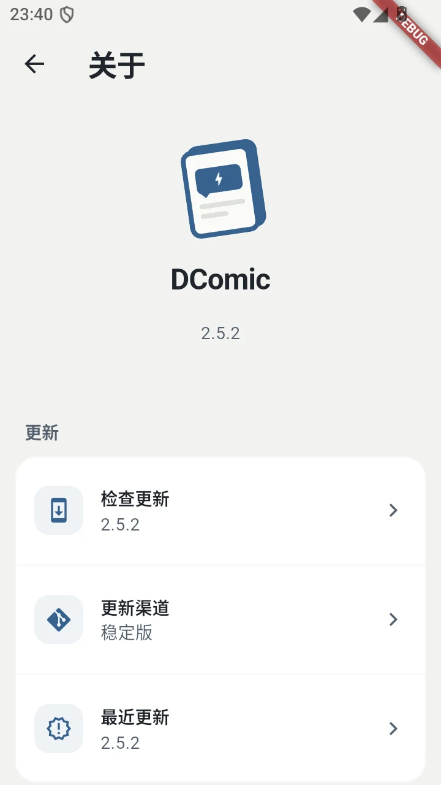</a></td>
  </tr>
</table>

### 账户与同步

<table>
  <tr>
    <td align="center" width="33%"><strong>数据库同步与备份</strong><br><sub>自动同步 · 按分类选择同步内容</sub></td>
    <td align="center" width="33%"><strong>账户设置</strong><br><sub>多源账户 · 个人信息已遮盖</sub></td>
    <td align="center" width="33%"><strong>实验性功能</strong><br><sub>跨源角标共享 · 自动匹配</sub></td>
  </tr>
  <tr>
    <td align="center"><a href="docs/screenshots/sync.webp">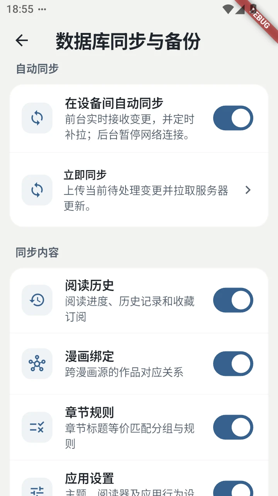</a></td>
    <td align="center"><a href="docs/screenshots/accounts.webp">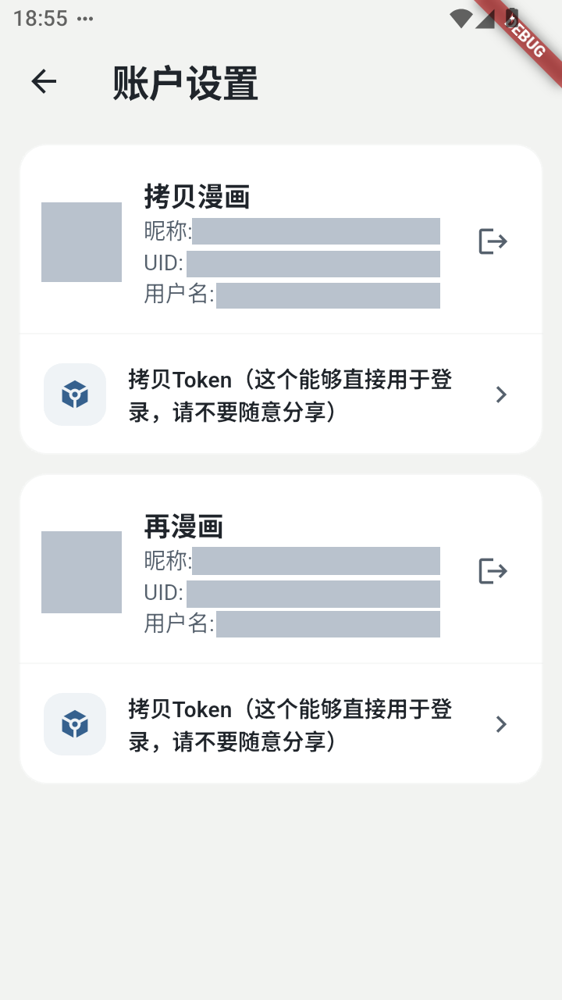</a></td>
    <td align="center"><a href="docs/screenshots/experiments.webp">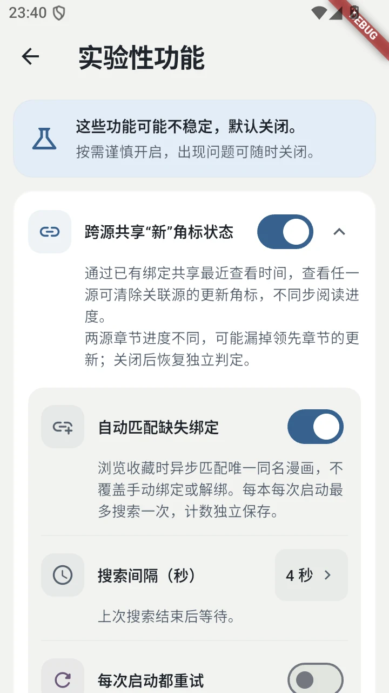</a></td>
  </tr>
</table>

### 主题与日夜模式

五种主题色均来自实际切换后的主页。每张取顶部约 **20% 高度**，错位叠排为一张条带图，不再逐张铺开整屏截图；日间与夜间使用另一张并排对照图。功能区保持浅色，夜间模式仅在这里展示。

<table>
  <tr>
    <td align="center" width="40%"><strong>主页主题色</strong><br><sub>蓝 · 红 · 粉 · 紫 · 浅绿</sub></td>
    <td align="center" width="60%"><strong>日间 / 夜间</strong><br><sub>相同主页布局，不同明暗模式</sub></td>
  </tr>
  <tr>
    <td align="center" valign="top"><a href="docs/screenshots/home-theme-colors.webp">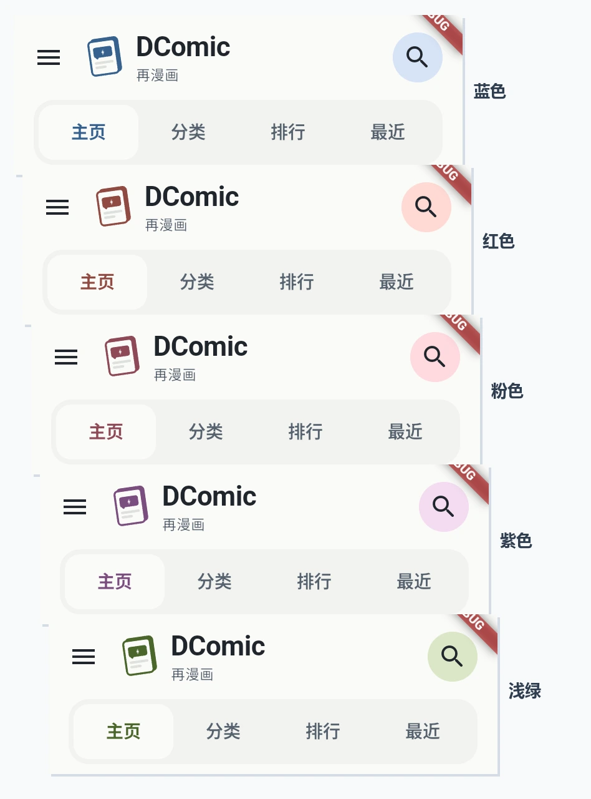</a></td>
    <td align="center" valign="top"><a href="docs/screenshots/home-day-night.webp">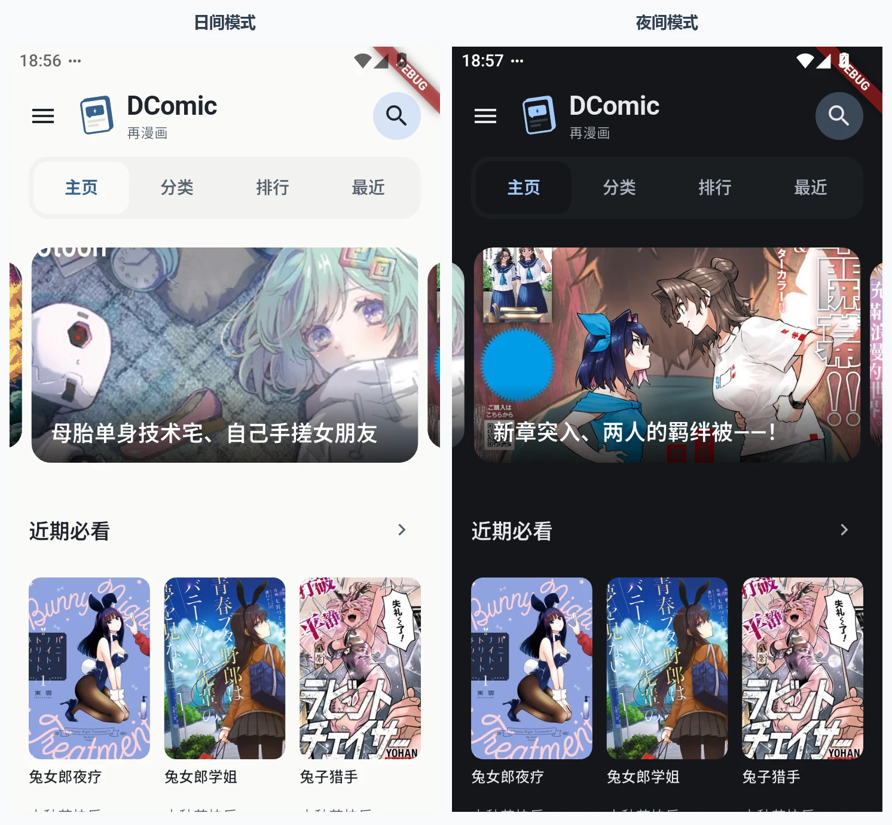</a></td>
  </tr>
</table>

### 宽屏预览

**首页双栏** · 左侧浏览，右侧承载选中漫画的详情。

<a href="docs/screenshots/wide-home.webp">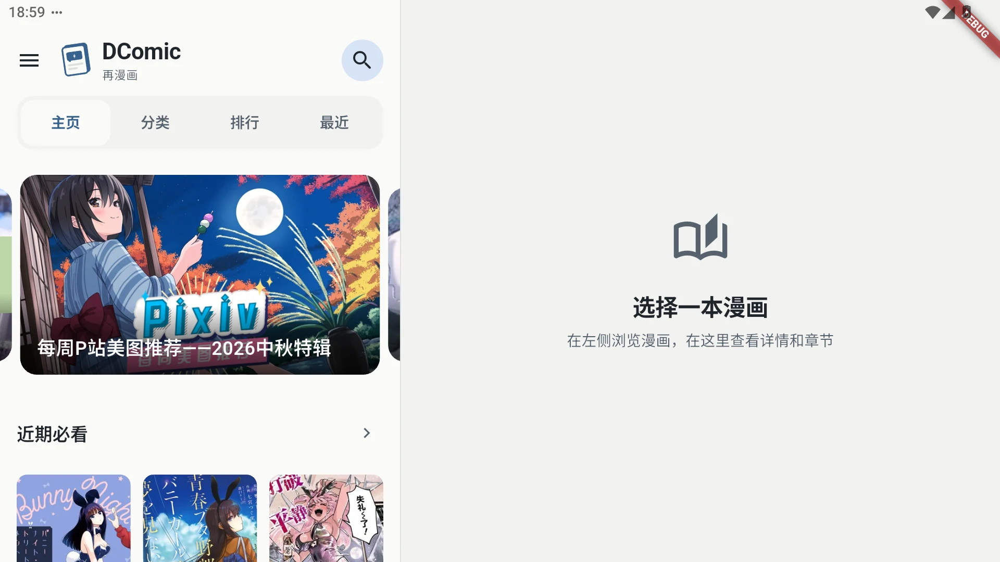</a>

**阅读目录** · 横向空间容纳阅读正文与章节抽屉。

<a href="docs/screenshots/wide-directory.webp">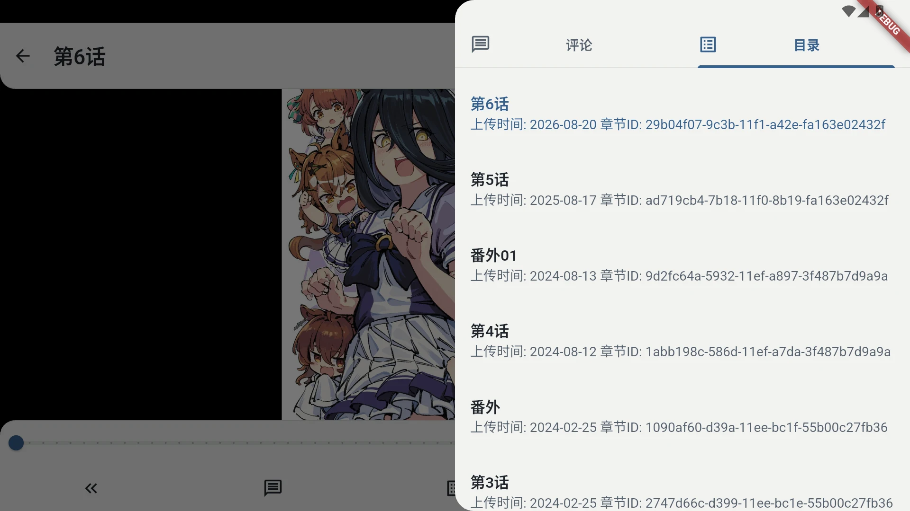</a>

## 部署同步服务器

同步服务器使用 Go + SQLite，单个 Docker 镜像内已包含独立的 Web Dashboard，无需另外部署前端。支持 `linux/amd64` 和 `linux/arm64`。

### 1. 启动容器

在已安装 Docker 的服务器上执行。下面使用 Bash / sh 多行语法；PowerShell 中请将 `docker run` 命令合为一行执行。

```sh
docker run -d --name dcomic-server --restart unless-stopped \
  -p 8080:8080 \
  -v dcomic-data:/data \
  hanerx/dcomic_server:latest
docker logs dcomic-server
```

- 服务监听 `8080`，数据库保存在 `/data/dcomic.db`；命名卷 `dcomic-data` 用于持久化，更新容器时必须保留。
- `latest` 跟随 `master` 的最近一次成功镜像发布；正式部署建议固定已发布的版本标签或 `sha-<完整 Git SHA>`。
- 镜像默认以容器内 root 运行，只挂载专用数据目录；不要开启特权模式或挂载 Docker socket。

### 2. 初始化并创建用户

1. 浏览器打开 `http://服务器地址:8080`，会自动进入 `/dashboard`。
2. 从容器日志中取得一次性初始化码，按页面提示设置管理员 `root` 的密码（12–72 个 UTF-8 字节）。
3. 登录 Dashboard，创建用于 App 同步的用户。服务不提供公开注册。
4. 在 App 的「设置 → 数据库同步与备份」填写服务器根地址、用户名和密码，选择需要同步的分类并开启同步。不要把 `/dashboard` 当作同步服务器地址。

初始化不需要 App。空数据库在重启后会生成新的初始化码；已有数据库完成初始化后不会再次要求设置管理员。

### 3. 公网部署与数据安全

> **公网请使用 HTTPS。** 上面的 HTTP 命令仅适合可信网络，同步不是端到端加密。只连接可信任的服务器。

<details>
<summary><strong>反向代理、凭据同步与备份注意事项</strong></summary>

反向代理需设置 `DCOMIC_PUBLIC_URL=https://你的域名`，限制后端端口暴露，保留公开 Host，并为 `/api/v1/events` 的 SSE 长连接关闭响应缓冲。

登录凭据（Cookie、Token 等）默认不参与同步，开启前请确认服务器可信。HTTPS 只保护传输，**同步不是端到端加密**，服务器管理员仍可访问存储的数据。应用处于后台或被关闭时不保证实时同步，回到前台后会继续补齐变更。

升级前先备份。SQLite 使用 WAL，运行中不能只复制 `dcomic.db`；可先停止容器，再备份完整 `/data` 目录。完整的反向代理、备份恢复、镜像升级和发布配置见 **[同步服务器部署文档](server/README.md)**。

</details>

### Dashboard 预览

独立浏览器后台支持用户与设备管理、同步数据统计、禁用用户、重置密码和撤销设备会话。下图来自隔离的本地演示环境，不包含生产用户数据。

<p align="center">
  <a href="docs/screenshots/dashboard.png">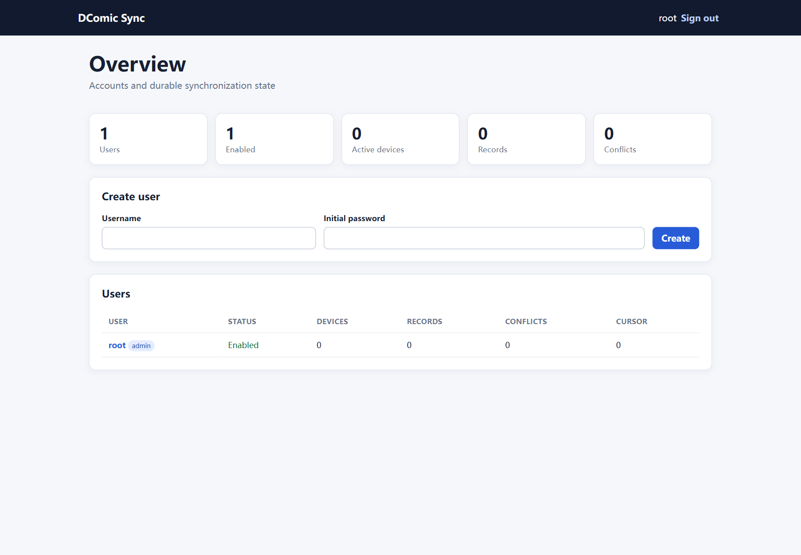</a>
  <br><sub>Web Dashboard · 用户管理 · 设备会话 · 同步统计</sub>
</p>

## 如何开发

应用和同步服务器在同一个仓库内，但有独立的依赖和运行环境：开发 App 不需要 Go，开发服务器不需要 Flutter。

### 架构与目录

<details>
<summary><strong>查看架构图与源码目录</strong> · Flutter 客户端 / Go 同步服务</summary>

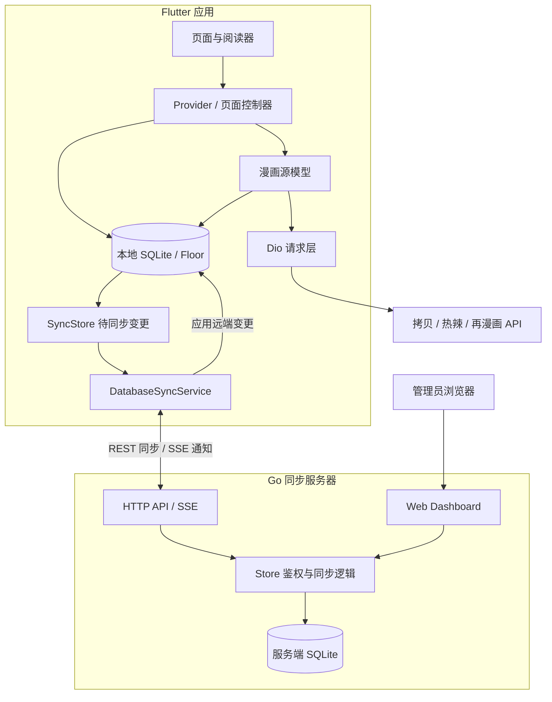
```mermaid
flowchart TB
    subgraph app[Flutter 应用]
        UI[页面与阅读器] --> State[Provider / 页面控制器]
        State --> Model[漫画源模型]
        Model --> HTTP[Dio 请求层]
        State --> DB[(本地 SQLite / Floor)]
        Model --> DB
        DB --> Queue[SyncStore 待同步变更]
        Queue --> Sync[DatabaseSyncService]
        Sync -->|应用远端变更| DB
    end
    HTTP --> Sources[拷贝 / 热辣 / 再漫画 API]
    subgraph server[Go 同步服务器]
        API[HTTP API / SSE] --> Store[Store 鉴权与同步逻辑]
        Dashboard[Web Dashboard] --> Store
        Store --> SQLite[(服务端 SQLite)]
    end
    Sync <-->|REST 同步 / SSE 通知| API
    Admin[管理员浏览器] --> Dashboard
```

| 路径 | 职责 |
| --- | --- |
| [`lib/view/`](lib/view/) | 页面、阅读器与共用 UI 组件。 |
| [`lib/providers/`](lib/providers/) | 应用状态、页面控制器、漫画源模型与同步服务。 |
| [`lib/requests/`](lib/requests/) | 各漫画源的请求、鉴权、Cookie 与 HTTP 缓存。 |
| [`lib/database/`](lib/database/) | Floor 实体、DAO、数据库迁移、同步存储与备份。 |
| [`lib/l10n/`](lib/l10n/) | 中英文 ARB 文案；生成结果位于 `lib/generated/`。 |
| [`server/`](server/) | Go 服务入口、HTTP API、Dashboard 与 SQLite 存储。 |
| [`test/`](test/) | Flutter 行为与数据库测试；Go 测试与服务端源码同目录。 |
| [`.github/workflows/`](.github/workflows/) | 应用构建发布、服务端 Docker 镜像发布。 |

</details>

### 开发应用

<details>
<summary><strong>展开应用开发指南</strong> · 环境、签名、运行与打包</summary>

**工具链**：Flutter **3.47.2**（与 CI 一致，配套 Dart **3.13.2**）。Android 使用 JDK **21**、SDK **36**，NDK 跟随 Flutter；Gradle、AGP 和 Kotlin 使用仓库内配置，不单独升级。iOS / macOS 开发需要 macOS 和 Xcode，iOS 另需 CocoaPods；Windows 开发需要 Visual Studio 的 C++ 桌面开发工具链，并开启开发者模式以支持插件符号链接。

```sh
git clone https://github.com/hanerx/DComicReborn.git
cd DComicReborn
flutter doctor
flutter pub get
dart run build_runner build
flutter devices
```

**Android 签名准备**：当前 Gradle 配置会在配置阶段读取 `android/key.properties`，调试运行也需要此文件。新克隆仓库时请使用自己的开发密钥，不要索取或提交发布密钥：

```sh
keytool -genkeypair -v -keystore android/app/local-dev.jks -alias local-dev -keyalg RSA -keysize 2048 -validity 10000
```

创建本地 `android/key.properties`（密码填写上一步自己设置的值）：

```properties
storePassword=你的密钥库密码
keyPassword=你的密钥密码
keyAlias=local-dev
storeFile=local-dev.jks
```

随后运行应用；`设备ID` 来自 `flutter devices`，Windows 可直接使用 `windows`，Mac 可使用 `macos`：

```sh
flutter run -d 设备ID
```

Windows 上建议把 Pub 缓存与项目放在同一盘符，避免 Kotlin 增量编译的跨盘路径错误，例如 PowerShell 中设置 `$env:PUB_CACHE = 'D:\Pub\Cache'` 后再获取依赖。若之前为仅构建 Android 设置过 `FLUTTER_WINDOWS=false`，开发 Windows 版前需移除此环境变量。

iOS 首次准备原生依赖时，在 `ios/` 执行 `pod install --repo-update`；升级原生依赖后如锁文件不兼容，再执行 `pod update --repo-update`。iOS 构建和签名须在 macOS 完成。

日常检查与构建（在仓库根目录执行，按目标平台选择）：

```sh
dart format lib test
flutter analyze
flutter test
flutter build apk --release
flutter build windows --release
flutter build macos --release
```

Windows 安装版另需 Inno Setup 6。构建后使用现有脚本打包，`-Version` 与 `pubspec.yaml` 中的三段版本号保持一致：

```powershell
powershell -NoProfile -ExecutionPolicy Bypass -File .github/scripts/package_windows.ps1 -Version 2.5.4
```

产物位于 `build/windows/packages/`。iOS 无签名编译可使用 `flutter build ios --release --no-codesign`，编译成功不代表已具备安装签名。

macOS 打包须在 Mac 上进行，构建后执行：

```sh
bash .github/scripts/package_macos.sh 2.5.10
```

版本参数与 `pubspec.yaml` 保持一致。产物位于 `build/macos/packages/`，同时提供 `DComicReborn-<版本>-macos-universal.zip` 和 `.dmg`。脚本校验双架构、执行权限与符号链接，使用 ad-hoc 签名，不需要 Apple 开发者证书；这不等于 Developer ID 签名或 Apple 公证。

在 **Actions → Flutter CI & Release → Run workflow** 中启用 `run_macos` 即可打包；如只需要 macOS，可关闭其他平台开关。macOS 始终构建 Release，不受 `build_type` 影响。推送 `develop` 或 tag 同样触发构建；成功的 tag 构建会将包上传到 GitHub Release，其余构建可下载 `macos-release` artifact。CI 包含应用进程启动检查，但不能替代真机交互验收。

macOS 尚未配置 Firebase，不启用 Firebase 遥测；错误保留在控制台日志中。应用内更新通过默认浏览器下载 DMG，不调用仅支持移动端的下载器。

</details>

### 性能监控

Android / iOS 接入 Firebase Performance，沿用现有 Firebase 项目。应用在 profile/release 模式启用自定义采集；debug 默认关闭，可用 `flutter run --dart-define=DCOMIC_PERFORMANCE=true` 验证事件链路。Windows 等不支持的平台不会调用 Performance 原生插件。正式性能评估请使用真机 profile/release，不能把 debug 或模拟器数值作为用户体验基准。

采集仅位于公共导航、请求和帧采样基础设施，页面、控制器与图片组件不接触监控 API。在 Firebase 控制台 **Performance → Custom traces** 查看：

| Trace / 指标 | 统计口径 |
| :--- | :--- |
| `navigation_next_route_frame` | 根导航及浏览／详情嵌套导航 push 或 replace 到下一次 Flutter post-frame；不是数据就绪、图片可见或硬件呈现时间。 |
| `navigation_forward_transition` | 同一导航变更到路由前进动画完成；不等待 `Navigator.push` 返回，不计页面停留时间。无可观察动画的自定义路由不记录此项。 |
| `request_response` | 公共 `RequestHandler` 的非流式 Dio 请求到最终响应／异常，包含拦截器、缓存命中、错误恢复和解码；不是纯网络传输时间。附 `method`、可用时的 `status_code`。独立 Dio 实例和流式下载不在此采集范围。 |
| `route_active_frames` | 根导航顶层为 `ComicViewerPage` 且应用在前台时，由公共指针／滚动 hook 驱动的活动帧聚合，附 `screen`、`refresh_rate_bucket`；不逐帧上传。 |

导航的 `screen` 直接使用已有 `RouteSettings.name`，不维护页面名映射、不反射或额外构建页面，无名路由跳过。路由名应保持静态，不放入搜索词、账号或其他业务数据。返回、替换、遮挡、分栏隐藏或进入后台时取消未完成采样，不将重新露出旧页面当作一次新打开。标签切换、数据就绪、首图、切章和其他业务操作完成时间无法由这些 hook 可靠判断，因此不记录。

耗时读取自定义 `elapsed_us`（微秒），它在 Dart 端观测边界冻结，不包含后续异步原生 Trace 停止等待；不要用 SDK Trace duration 替代该值。按 `outcome` 区分 `success`、`error`、`http_error`、`cancelled`；请求结果指 Dio 最终结果，不代表响应中的业务状态码成功。

活动帧记录 `frame_count`、`over_budget_frames`、`max_build_us`、`max_raster_us`、`active_duration_us`、`fps_milli`。FPS = `fps_milli / 1000`，以活动窗口内不同 vsync 时间戳的帧数减一，除以首末时间戳间隔计算；不足两个不同时间戳的帧不产生 FPS。600 ms 输入尾窗只用于帧归属，FPS 分母不包含首尾无帧空闲。每段最多 15 秒，保留 1.5 秒接收迟到批次；后台、路由遮挡及刷新率变化时分段，销毁后无法补收尚未到达的批次。

此指标是阅读器**路由内全部 UI 活动**，包括内部抽屉、设置和评论等，不能解释为漫画图片独占帧率，也不区分阅读模式。`route_active_frames` 的 Trace duration 和 `elapsed_us` 包含迟到批次等待，不是连续绘制时间；帧率只使用 `active_duration_us` 对应的采样区间。

超预算帧指 Build **或** Raster 单阶段超过 `1 秒 / 当前刷新率`，不把两个流水线阶段相加；未知刷新率标记 `unknown` 并按 60 Hz 判断。`over_budget_frames / frame_count` 可用于比较卡顿比例，但不是屏幕精确丢帧数。Firebase 不自动提供每个 Flutter 页面的慢帧统计，具体定位仍使用 DevTools。

自定义采集不读取搜索词、漫画名、账号、Token、请求 URL 或响应内容；Firebase SDK 的自动采集仍遵循其自身数据规则。Android debug 可在 Logcat 的 `FirebasePerformance` 标签确认 `Logging trace metric` 和各指标；本地日志表示 SDK 已记录，不等于已确认控制台入库，网络可达性和控制台展示延迟需另行核对。iOS 原生依赖与运行须在 macOS 验证。

### 开发同步服务器

<details>
<summary><strong>展开服务端开发指南</strong> · Go 环境、启动与真机联调</summary>

服务端是独立 Go module，入口、HTTP 层和存储层分别位于 `server/cmd/`、`server/internal/httpserver/` 和 `server/internal/store/`。Dashboard 使用 Go HTML 模板随服务打包，没有单独的 Node.js 前端构建流程。

安装 **Go 1.26.0 或兼容的更新版本**，在仓库根目录进入服务端模块：

```sh
cd server
go mod download
go run ./cmd/dcomic-server serve --listen 127.0.0.1:8080 --db data/dev.db
```

打开 `http://127.0.0.1:8080/dashboard`，用启动日志中的初始化码设置开发环境的管理员密码。使用独立的 `data/dev.db`，不要拿真实同步数据库调试。停止进程后可在 `server/` 执行：

```sh
go fmt ./...
go test ./...
go vet ./...
go build -o bin/dcomic-server ./cmd/dcomic-server
```

修改 HTTP API 或 Dashboard 时从 `internal/httpserver/` 入手；鉴权、用户管理、同步冲突和 SQLite 持久化位于 `internal/store/`。模板修改后需重启服务。监听地址、数据库路径和公开 origin 也可分别通过 `DCOMIC_LISTEN`、`DCOMIC_DB`、`DCOMIC_PUBLIC_URL` 设置。

联调时在 App 中填写开发服务器地址。真机应使用开发机的局域网地址，并将监听地址改为 `0.0.0.0:8080`、按需放行防火墙；真机的 `127.0.0.1` 指向真机本身。只在可信网络暴露开发服务，用两个独立客户端验证变更是否真正同步。

</details>

### 同步流程

<details>
<summary><strong>查看同步时序图</strong> · 本地写入 / 增量同步 / 冲突处理</summary>

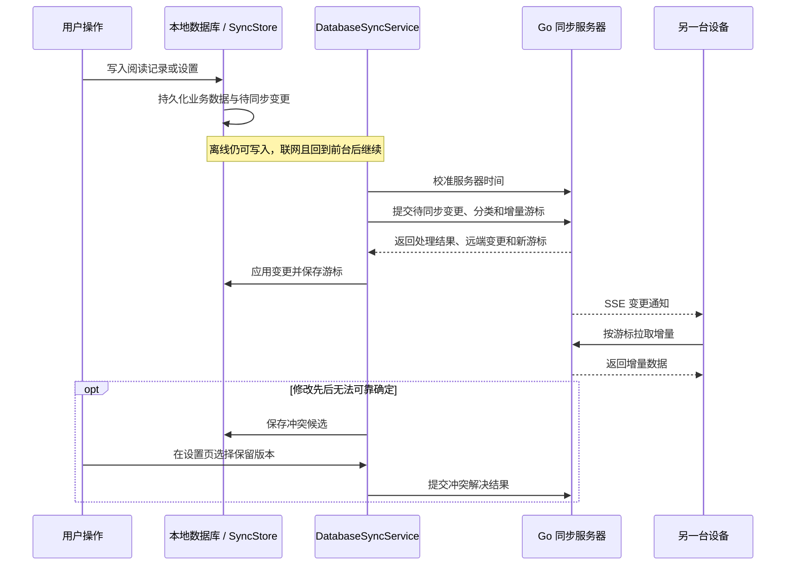
```mermaid
sequenceDiagram
    participant U as 用户操作
    participant L as 本地数据库 / SyncStore
    participant C as DatabaseSyncService
    participant S as Go 同步服务器
    participant D as 另一台设备
    U->>L: 写入阅读记录或设置
    L->>L: 持久化业务数据与待同步变更
    Note over L,C: 离线仍可写入，联网且回到前台后继续
    C->>S: 校准服务器时间
    C->>S: 提交待同步变更、分类和增量游标
    S-->>C: 返回处理结果、远端变更和新游标
    C->>L: 应用变更并保存游标
    S-->>D: SSE 变更通知
    D->>S: 按游标拉取增量
    S-->>D: 返回增量数据
    opt 修改先后无法可靠确定
        C->>L: 保存冲突候选
        U->>C: 在设置页选择保留版本
        C->>S: 提交冲突解决结果
    end
```

SSE 用于通知有变更，数据通过同步 API 拉取。删除同样参与同步；冲突不简单按“最后上传者覆盖”处理。调整同步协议时，需要同时检查客户端 `lib/database/sync/`、`DatabaseSyncService` 与服务端 Store，不能只改其中一端。

</details>

### 数据库同步契约

同步策略必须在数据库定义层显式登记，不采用“未登记就本地保存”或“未排除就自动上传”的默认行为：

- [`database_sync_contract.dart`](lib/database/database_sync_contract.dart) 声明每张业务表的同步方式，以及每个字段属于传输值、记录标识、本地字段还是本地关联。不同步的表和字段必须说明原因；同步内部表也逐项登记为本地数据。SQL 变更捕获和传输字段投影消费这份声明。
- [`setting_sync_contract.dart`](lib/database/setting_sync_contract.dart) 声明配置表中每个键的策略：`synced` 必须提供值校验器，`localOnly` 必须说明原因，`credential` 只进入用户单独开启的凭据分类。动态键只能使用显式登记的命名空间；不再通过名称包含 `token`、`secret` 等片段猜测分类。增加设置只登记一次，SQL 筛选与接收校验均由同一条定义生成。
- 数据库打开并完成迁移后，自动对照 SQLite 实际表和字段检查完整性，并检查已有配置键；未声明、新增或已经失效的字段声明都会报出具体表／字段。构造未知配置对象立即报错；SQLite 守卫也拦截原始 SQL、更新配置键和批量写入中的未知键，即使同步尚未开启也生效。

修改实体时，同步更新契约和数据库迁移；不要通过添加默认忽略分支掩盖错误。已有库中发现未登记键时，应确认其语义后补充显式策略或迁移，不能清空用户数据。

```sh
flutter test test/database_sync_policy_test.dart test/sync_store_test.dart test/database_upgrade_test.dart
```

### 开发规范与提交流程

1. **保持分层**：UI 负责展示与交互，页面控制器和模型处理状态，源站协议放在 `lib/requests/`。新增漫画源时复用现有模型接口，不把域名、请求头和解析逻辑散落到页面。
2. **先保住数据**：修改实体或 DAO 后运行 `dart run build_runner build`，不要手改 `.g.dart`。数据库结构变化必须提供版本迁移，验证旧数据、删除和重新打开；不要绕过现有同步写入机制。
3. **沿用界面与文案约定**：使用已有主题和响应式组件，检查窄屏、宽屏、深浅主题及键盘展开。文案维护在 `lib/l10n/` 的 ARB 文件中，用 Flutter Intl 插件重新生成，不手改 `lib/generated/`。
4. **用行为证明改动**：Dart 遵循 `analysis_options.yaml` 的 Flutter lints，Go 使用 `gofmt`。修复应有针对原问题的回归验证；UI 要实际打开检查，同步修改要验证离线补传、账号隔离、删除与冲突。
5. **不提交敏感信息**：密钥、`key.properties`、真实用户数据库、Token、Cookie 和备份不进入提交。日志、截图及问题反馈也要去除凭据和个人信息。
6. **提交说明写清范围与验证**：可沿用 `feat(sync): ...`、`fix(reader): ...`、`docs(readme): ...` 等格式；PR 说明修改原因、受影响平台和实际执行的检查，避免夹带无关重构。

发布时同步更新 `pubspec.yaml` 和 [RELEASE_NOTES.md](RELEASE_NOTES.md)，先提交对应版本说明，再推送版本标签。应用工作流会汇总产物并生成 Release；服务端工作流独立发布 Docker 镜像。不要直接修改已发布标签来覆盖旧版本。

## 鸣谢

- **[hanerx](https://github.com/hanerx)**：本项目开发者与维护者。感谢所有通过 [Issue](https://github.com/hanerx/DComicReborn/issues)、PR 和测试反馈参与改进的朋友；完整贡献记录见 [Contributors](https://github.com/hanerx/DComicReborn/graphs/contributors)。
- **[LittleSurvival/copymanga-copy20](https://github.com/LittleSurvival/copymanga-copy20)**：本项目部分漫画源 API 的访问方式与适配实现参考并获取自该仓库，尤其是拷贝 / 热辣的请求头、章节路径差异及独立吐槽线路。当前相关协议参考其 [v1.4.84 版本产物](https://github.com/LittleSurvival/copymanga-copy20/blob/7591be034286bb19bc8380c4ec3fd8622090f175/apk/tachiyomi-zh.copymanga-v1.4.84.apk)。这不表示上游提供本项目的同步服务或对本项目作出背书。
- **[fumiama/copymanga](https://github.com/fumiama/copymanga)**：本 README 的界面预览表格与展示方式参考了该项目；这里展示的截图均来自 DComicReborn。
- **Flutter、Dart、Go 及开源依赖的维护者**：感谢底层框架、网络、数据库和阅读组件的支持，依赖列表见 [pubspec.yaml](pubspec.yaml) 与 [server/go.mod](server/go.mod)。
- **素材原作者与权利人**：分类图片的来源和裁切记录见 [素材清单](assets/copymanga/credits.json)。来源标注不代表转载授权，相关作品版权仍归原权利人所有。
